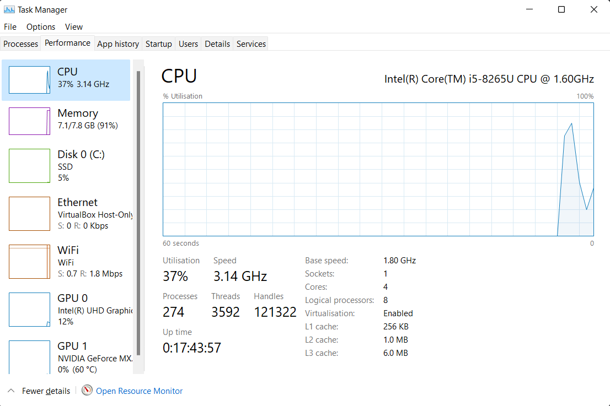

# Vagrant Intro

## Common Commands for Vagrant

**_NOTE:_** Usage: `vagrant [options] <command> [<args>]`

| Command | Description |
|---------|-------------|
|box|manages boxes: installation, removal, etc.|
|cloud|manages everything related to Vagrant Cloud|
|destroy|stops and deletes all traces of the vagrant machine|
|global-status|outputs status Vagrant environments for this user|
|halt|stops the vagrant machine|
|help|shows the help for a subcommand|
|init|initializes a new Vagrant environment by creating a Vagrantfile|
|login||
|package|packages a running vagrant environment into a box|
|plugin|manages plugins: install, uninstall, update, etc.|
|port|displays information about guest port mappings|
|powershell|connects to machine via powershell remoting|
|provision|provisions the vagrant machine|
|push|deploys code in this environment to a configured destination|
|rdp|connects to machine via RDP|
|reload|restarts vagrant machine, loads new Vagrantfile configuration|
|resume|resume a suspended vagrant machine|
|snapshot|manages snapshots: saving, restoring, etc.|
|ssh|connects to machine via SSH|
|ssh-config|outputs OpenSSH valid configuration to connect to the machine|
|status|outputs status of the vagrant machine|
|suspend|suspends the machine|
|up|starts and provisions the vagrant environment|
|upload|upload to machine via communicator|
|validate|validates the Vagrantfile|
|version|prints current and latest Vagrant version|
|winrm|executes commands on a machine via WinRM|
|winrm-config|outputs WinRM configuration to connect to the machine|

## Check if CPU has virtualization support

Check if CPU has virtualization `Enabled` or `Disabled`:

## How to enable Vagrant

[Windows Offical Documentation](https://learn.microsoft.com/en-us/virtualization/hyper-v-on-windows/quick-start/enable-hyper-v)

[Video Guide](https://www.youtube.com/watch?v=gmN6B_H9xj4)

## Linux Basics

- check internet connectivity `sudo apt-get update`
- run upgrade `sudo apt-get upgrade -y`
- Where am I `pwd`
- Who am I `whoami`
- Kernel version `uname -a`
- Create a directory `mkdir`
- Create a file `touch <filename>`
- List files `ls -a`
- Edit a file `nano <filename>`
- Move into a directory `cd <directory>` and `cd ..`
- Remove a file `rm <filename>` and `rm -rf <directory>`
- Copy a file `cp <filename> <newfilename>`
- Move a file `mv <filename> <newfilename>`
