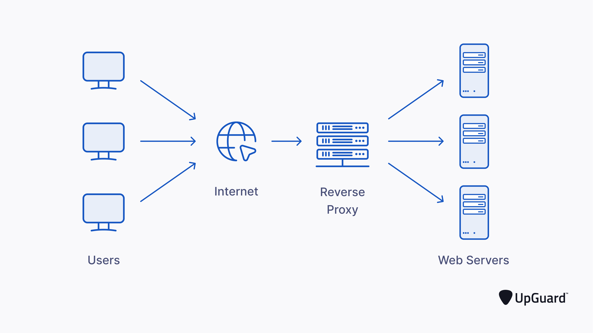

# Setting Up Nginx as a Reverse Proxy Server



## Introduction

Having Installed all prerequisites, we can now proceed to setting up Nginx as a reverse proxy server.

## Step 1 - Locate the Nginx default configuration file

The default configuration file for Nginx is located at `/etc/nginx/sites-available/default`. Open the file.

```bash
sudo nano /etc/nginx/sites-available/default
```

## Step 2 - Edit the Nginx default configuration file

Once the file is open, we need to edit it to look like the following:
And make sure to change the `proxy_pass` to the IP address of the server you want to proxy to, ie. `http://localhost:3000`

```bash
server {
    listen 80 default_server;
    listen [::]:80 default_server;

    root /var/www/html;

    index index.html index.htm index.nginx-debian.html;

    server_name _;

    location / {
        proxy_pass http://localhost:8080; #Change this to the port of your application
        proxy_http_version 1.1;
        proxy_set_header Upgrade $http_upgrade;
        proxy_set_header Connection 'upgrade';
        proxy_set_header Host $host;
        proxy_cache_bypass $http_upgrade;
    }
}
```

Save and exit the file. We can now proceed to testing the configuration.

## Step 3 - Test the Nginx configuration

To test the Nginx configuration, we need to run the following command:

```bash
sudo nginx -t
```

If the configuration is correct, you should see the following output:

```bash
nginx: the configuration file /etc/nginx/nginx.conf syntax is ok
nginx: configuration file /etc/nginx/nginx.conf test is successful
```

## Step 4 - Restart Nginx

To restart Nginx, we need to run the following command:

```bash
sudo systemctl restart nginx
```

## Step 5 - Test the Nginx reverse proxy

To test the Nginx reverse proxy, we need to open a browser and navigate to the IP address of the server. If everything is set up correctly, you should see your application running.
