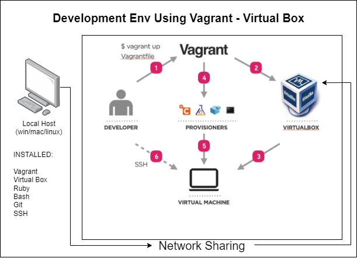

# Virutualisation

## What is virtualisation & benefits of it

Virtualisation is the process of creating a virtual (rather than actual) version of something, such as an operating system, a server, a storage device or network resources. A virtual machine (VM) is an emulation of a physical computer system. Virtual machines are based on computer architectures and provide functionality of a physical computer. Their implementations may involve specialized hardware, software, or a combination.

Virtualisation allows you to run multiple operating systems on a single physical server. This means you can run multiple virtual machines on a single server, which reduces the number of physical servers you need to buy and maintain. This can save you money on hardware, power, cooling, and space.

### Benefits of virtualisation

- **Cost savings**
- **Increased flexibility**
- **Improved security**
- **Improved performance**
- **Improved availability**

## What is Dev Env

A development environment is a set of tools and processes that developers use to create software. It includes the operating system, programming languages, libraries, and other tools that developers use to write and test code.

## What is vagrant

Vagrant is a tool for building and managing virtual machine environments in a single workflow. With an easy-to-use workflow and focus on automation, Vagrant lowers development environment setup time, increases production parity, and makes the "works on my machine" excuse a relic of the past.

## What is virtual box

VirtualBox is a general-purpose full virtualizer for x86 hardware, targeted at server, desktop and embedded use. For a thorough introduction to virtualization and VirtualBox.
